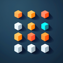

## Studio Organizer (Roblox Studio Plugin)

[**Get Studio Organizer on Roblox**](https://create.roblox.com/store/asset/96423134102803/Studio-Organizer)

[**Roblox Dev Forum**](https://devforum.roblox.com/t/studio-organizer-%E2%80%93-drag-and-drop-tagging-for-roblox-studio/4463286)

Studio Organizer is a Roblox Studio plugin that provides a dockable panel for organizing instances in your place using tags, search, and quick actions. It makes it easier to find, group, and manage objects in large or complex projects.

### Why Studio Organizer?

- **Large places get messy fast**: Deep hierarchies and many instances make it hard to find what you need.
- **Tags beat folders**: Roblox `CollectionService` tags let you organize objects by role or feature, not just by where they sit in the Explorer.
- **Search-first workflow**: Instead of scrolling through the Explorer, you can jump straight to what you’re looking for using tags and text search.

### Features

- **Dockable organizer panel**: Opens as a docked widget on the right side of Roblox Studio.
- **Tag-based organization**: Uses Roblox `CollectionService` tags (via `TagManager`) to group and organize instances.
- **Fast search**: `SearchEngine` powers quick filtering and lookup of tagged objects.
- **Favorites support**: `FavoritesManager` allows marking tags or objects you use frequently.
- **Tag editor UI**: Rich `TagEditor` interface for creating, editing, and removing tags from selected objects.
- **Presets and helpers**: Utility modules for quick presets, colors, settings keys, and tag icons.
- **Plugin-aware design**: All core systems are driven by the Roblox `plugin` object and a single dock widget.

### Project Structure

- **`Main.lua`**: Entry point. Creates the dock widget and wires together core modules and the main UI panel.
- **`Modules/Core`**
  - **`TagManager.lua`**: Manages tagging of instances and interaction with Roblox tagging APIs.
  - **`SearchEngine.lua`**: Handles searching and filtering of tagged objects.
  - **`LicenseManager.lua`**: Handles any licensing / activation logic for the plugin.
  - **`FavoritesManager.lua`**: Keeps track of frequently used tags or objects.
- **`Modules/UI`**
  - **`MainPanel.lua`**: Builds the main docked UI and coordinates subcomponents.
  - **`TagEditor.lua`**: Advanced editor for viewing and modifying tags on selected objects.
  - **`SettingsDialog.lua`**: Settings/preferences UI for the plugin.
  - **`Components`**: Reusable UI pieces such as `ObjectList.lua` and `TagChip.lua`.
- **`Modules/Utils`**
  - Helpers for storage, presets, colors, tag icons, settings keys, and other general utilities (non-exhaustive).
- **`Modules/Models`**
  - Data models such as `Tag.lua`.

### Installation

- **From the Roblox Creator Store**
  - Open the [Studio Organizer plugin page](https://create.roblox.com/store/asset/96423134102803/Studio-Organizer).
  - Click **Get** (or **Install**) and enable the plugin in Roblox Studio.
  - Studio will handle updates for you automatically.

> This repository contains the **source code** for Studio Organizer, primarily for transparency, learning, and contributions. You do **not** need to clone or modify the source to install or use the plugin.

### Usage

- After installing, enable the plugin from the **Plugins** tab in Roblox Studio.
- The **Studio Organizer** dock widget should appear on the right side. If it is hidden, open it from the **View** tab or the **Plugins** tab.
- Typical workflow:
  - **Select objects** in the Explorer that you want to group logically.
  - **Apply tags** using the Tag Editor (for example: `"Enemy"`, `"Pickup"`, `"UI"`, `"Interactable"`).
  - **Search** by tag or name in the main panel to quickly jump to those objects in large places.
  - **Manage favorites** for commonly used tags or objects.
  - **Adjust settings** via the settings dialog.

### Development Notes

- The plugin is initialized in `Main.lua` via:
  - Creation of the dock widget (`DockWidgetPluginGuiInfo`).
  - Construction of `TagManager`, `LicenseManager`, and `SearchEngine`.
  - Creation of `MainPanel` with the dock widget and core services.
- All modules under `Modules` are required relative to the `Main.lua` script, so the in-Studio hierarchy should mirror the folder layout here.

### Status

- **Project status**: Stable and published on the Roblox Creator Store.

### Contributing

- **Bug reports & feature requests**: Open an issue in this repository if you find a bug or have a feature request.
- **Pull requests**: Please keep changes focused and include a brief description of what you changed and why.

### License

This project is licensed under the **MIT License**.  
See the `LICENSE` file for full details.
